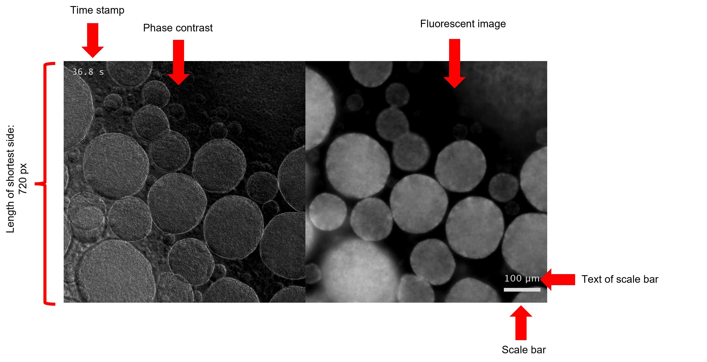
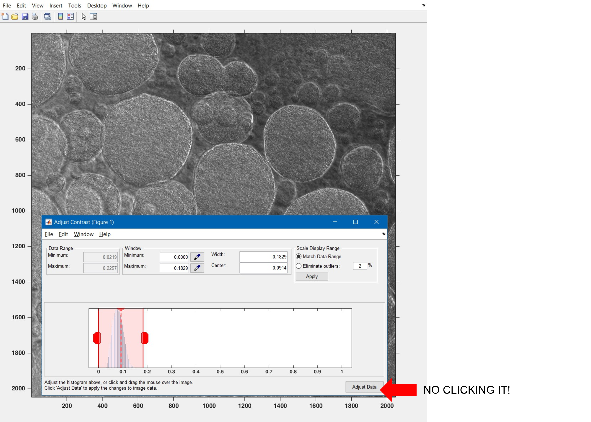

# VideoLabeller

Convert nd2 file into mp4 video with scalebar and timestamp in MATLAB.

Free your hands and no worry about low memory anymore!

This program helps to convert nikon .nd2 file into .mp4 video with scalebar and timestamp in MATLAB with one click.  It automatically regconizes the objectives from filename and time points of images from the metadata, and is able to combine and output a multi-channel video of desired contrast.  

IMPORTANT: Require [Nd2SdkMatlab](https://github.com/tytghy/Nd2SdkMatlab/) to read nd2 file.  

## Basic Usage

1. Adjust the parameters in `parameters.m`.
2. Run it.

## Parameters

### File

| Parameters | Description |
| ----------- | ----------- |
| `filename` | File to be converted |
| `savedir` | Directory to save the output video |

### Image acquisition

Note: The program can automatically recognize the objective from the filename in a format like '**\_10x_**', '**10x_**'.  It is stronlgy suggested that you modify the filename for better experience.

| Parameters | Description |
| ----------- | ----------- |
| `objective` | Objective used.  If you have a filename specified the objective, the program will ignore this parameter.  |
| `nFreqDiv` | Number of frequency division. E.g., `1`|
| `startTime` | Starting time (s).  E.g., `0`|

### Exported images

All the parameters related to the exported channels include in the struct `exportPara`.

| Parameters | Description |
| ----------- | ----------- |
| `exportedT` | Export images of time (frame) ranging from `exportedT(1)` to `exportedT(2)`.  Leave it empty `[]` if all are wanted.  E.g., `[1 200]`|
| `exportEveryNumFrame` | Export images every `exportEveryNumFrame` frames. E.g., `2`|
| `exportedFreqNo` | If `nFreqDiv` is not 1, export images in Channel `exportedFreqNo`. Leave it empty `[]` if all are wanted.  E.g., `[]`|
| `exportedChannelNo` | Export images in $\lambda$ Channel `exportedChannelNo`. Leave it empty `[]` if all are wanted. E.g., `[1 2 3]`|
| `exportedXYNo` | Export images in $XY$ Channel `exportedXYNo`. Leave it empty `[]` if all are wanted. E.g., `[1 2 3]`|
| `exportedZNo` | Export images in $Z$ Channel `exportedZNo`. Leave it empty `[]` if all are wanted. E.g., `[]` |
| `shortestSideLength` | The wanted length of shortest side of resized output video.  E.g., `720`.|

### Post-processing images

| Parameters | Description |
| ----------- | ----------- |
| `contrastMethod` | Method to adjust contrast of video.  `0`: do nothing; `1`: auto contrast; `2`: manual contrast.  E.g., `2`|
| `needScalebar` | Label scale bar? `0`: No need; `1`: Need|
| `needScaleText` | Label the corresonding size of scale bar?  `0`: No need; `1`: Need|
| `needTimeStamp` | Label the time stamp? `0`: No need; `1`: Need|

### Output video

| Parameters | Description |
| ----------- | ----------- |
| `isCompressed` | Compress the output video? `0`: output a high-resolution but large .avi video; `1`: output a compressed but small .mp4 video.|
| `frameRate` | Frame rate of output video.  E.g., `20`. |

### Snapshot

You can attach the snapshot in the report and briefly see what's going on without watching a video.

| Parameters | Description |
| ----------- | ----------- |
| `needSnapshot` | Need snapshots? `0`: No need; `1`: Need|
| `nSnap` | How many snapshots do you need? E.g., `4`. |

## Output example

To see the fast-evolved phenomenon simultaneously in fluorescence and phase contrast microscopy, we acquired a fast timelapse image sequence with fluorescent (f) and phase contrast (pc) images in alternate frames using [Custom-build Multichannel Splitter](https://wulab.yuque.com/wulab/knowledgebook/multi-channel-splitter).  Here, we used the program below to output the video.  The key is to set `nFreqDiv = 2` because the iamge sequence is splitted manually into two channels of order pc-f-pc-f. 

```matlab
% Parameters for ND2 to video with scalebar and time stamp.

%% File:
% filename, savedir
filename = 'G:\exp_script\GitProject\sample\20x_phase_contrast_fluorescent_images.nd2';
savedir = 'G:\exp_script\GitProject\sample\';

%% Image acquisition:
% objective, nFreqChannel, nPosFrames.

objective = 10; % as objective is indicated in filename, program will ignore this line.
nFreqDiv = 2;
startTime = 0; % s

%% Exported images:
% exportedT, exportedFreqChannelNo, shortestSideLength, needImgCombined,
% needScalebar, needScaleText, needTimeStamp. 
% Empty for all.

exportPara.exportedT = []; % T from T(1) to T(2)
exportPara.exportEveryNumFrame = 2; % output every frame needs more memory.  here output every 2 frame.

% At most two dimensions can be selected. For example, if channelNo and
% XYNo contains multiple elements, ZNo must be a scalar.
exportPara.exportedFreqNo = []; 
exportPara.exportedChannelNo = []; 
exportPara.exportedXYNo = [];
exportPara.exportedZNo = [];
exportPara.shortestSideLength = 720;

processPara.contrastMethod = 1; % 0: no adjust contrast; 1: auto contrast; 2: manual contrast
processPara.needScalebar = 1;
processPara.needScaleText =1;
processPara.needTimeStamp = 1;

%% Video:
% isCompressed, frameRate.
isCompressed = 1; % 1 for 'MPEG-4' and 0 for 'Grayscale AVI'
frameRate = 20;

%% Snapshot montage:
% needSnapshot, nSnap
needSnapshot = 0;
nSnap = 4;

%% Execute
labelimage;
```


A snapshot of the output video:



## Adjust contrast manually

If you are sad for auto-contrast, i.e., `contrastMethod = 1`, then try to adjust contrast manually by `contrastMethod = 2`.  

In this senario, you are asked to adjust 3 images from each channel.  Close the window after adjusting the contrast.  Do not click `Adjust Data`.  


