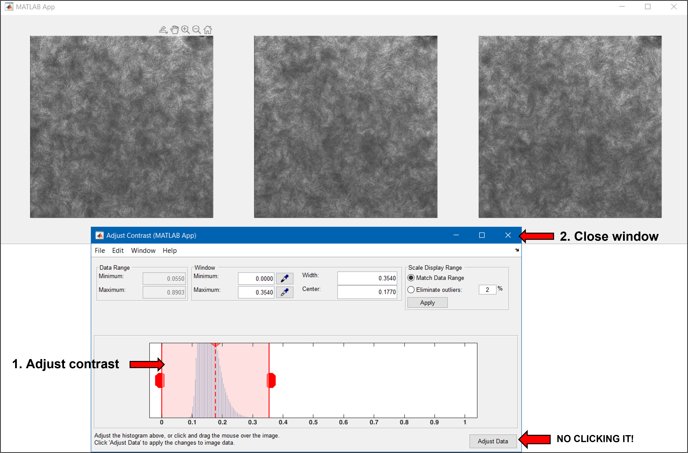
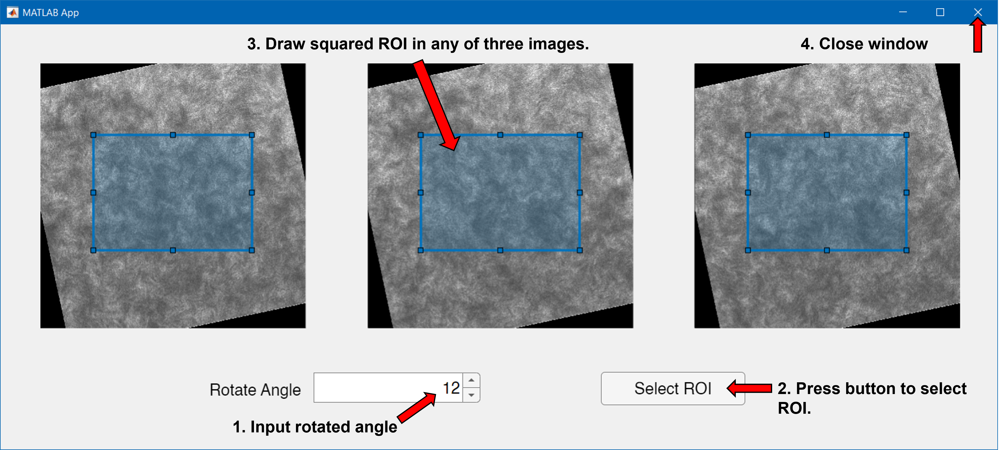
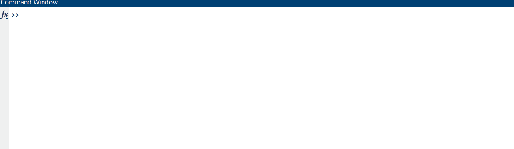
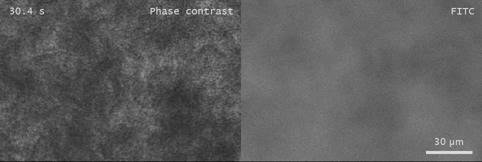

```
             _   _      _  ____    _           _           _ _
            | \ | |  __| ||___ \  | |     ____| |__   ___ | | | ___  _____
            |  \| | / _  |  __) | | |    / _  |  _ \ / _ \| | |/ _ \|  __/
            | |\  || (_| | / __/  | |___| (_| | |_) |  __/| | |  __/| |
            |_| \_| \____||_____| |__ __|\____|_ __/ \____|_|_|\____|_|
```

# Nd2Labeller: Simply Convert and Label Your `.nd2` Files!


Nd2Labeller is a powerful MATLAB tool that simplifies the process of converting `.nd2` files into well labeled `.mp4` videos. Say goodbye to the annoying and slowwww procedures of loading, manual conversion and labeling, and let Nd2Labeller do the heavy lifting for you!

## Features

- Seamlessly convert `.nd2` files to `.mp4` videos
- Automatically label your videos with customizable titles, scale bars, and timestamps
- Adjust contrast and draw regions of interest (ROI) with ease
- Fine-tune export settings to control time range, frequency, channels, and more
- Output high-quality videos with adjustable frame rates and compression options

<!-- GETTING STARTED -->

## Getting Started

### Prerequisites

- **Matlab**

- **Computer Vision Toolbox** ('Home' --> 'Add-Ons')

- **Image Processing Toolbox** ('Home' --> 'Add-Ons')

- **[Nd2SdkMatlab](https://github.com/tytghy/Nd2SdkMatlab/)** (for reading `.nd2` files).

- **[ProgressBar](https://github.com/tytghy/ProgressBar)**

### Installation

1. Clone the repository using [`git`](https://git-scm.com/)

   ```sh
   git clone https://github.com/tytghy/VideoLabeller.git
   ```

2. Or download the ZIP file from [Nd2Labeller](https://github.com/tytghy/Nd2Labeller) and extract it.

## Usage

1. Customized the parameters in `demo.m` according to your raw data and preferences.
2. Run the script.

> Check out the **[Example](#example)** for a step-by-step guide on using Nd2Labeller.

## Parameters

Nd2Labeller offers a wide range of customizable parameters to suit your needs. Adjust settings related to:

- File input and output
- Image acquisition
- Exported images
- Image post-processing
- Output video

Here's a detailed overview of the available parameters:

### File Input and Output

| Parameter  | Description                                        |
| ---------- | -------------------------------------------------- |
| `filename` | The `.nd2` file to be converted                    |
| `savedir`  | The directory where the output video will be saved |

### Image Acquisition

| Parameter   | Description                                                                                                |
| ----------- | ---------------------------------------------------------------------------------------------------------- |
| `objective` | The objective used during image acquisition. If specified in the filename, this parameter will be ignored. |
| `nFreqDiv`  | The number of frequency divisions. E.g., `1`                                                               |
| `startTime` | The starting time of the image sequence in seconds. E.g., `0`                                              |

> **Note**
>
> - Nd2Labeller automatically detects the objective from the filename if it contains patterns like `_?x_`, `?x_`, or `_?x.nd2`. For instance, the objective will be recognized as 20x for filenames such as '20x_cell.nd2', 'cell_20x.nd2', or 'cell_20x_liquid.nd2'.
>
> - By default, Nd2Labeller assumes a 6.5 µm pixel camera sensor. This means that with a 10x objective, the pixel size in the image will be 6.5/10 = 0.65 µm.

### Exported Images

The `exportPara` struct contains all the parameters related to the exported channels.

| Parameter             | Description                                                                                                                           |
| --------------------- | ------------------------------------------------------------------------------------------------------------------------------------- |
| `exportedT`           | The time or frame range to export. Specify as `[startFrame endFrame]`. Leave empty `[]` to export all frames. <br /> E.g., `[1 200]`. |
| `exportEveryNumFrame` | The interval at which to export frames. <br /> E.g., `2` will export every 2nd frame.                                                 |
| `exportedFreqNo`      | The frequency channel numbers to export if `nFreqDiv` is not 1. Leave empty `[]` to export all. <br /> E.g., `[1]`                    |
| `exportedChannelNo`   | The $\lambda$ channel numbers to export. Leave empty `[]` to export all. <br /> E.g., `[1 2 3]`                                       |
| `exportedXYNo`        | The $XY$ channel numbers to export. Leave empty `[]` to export all. <br /> E.g., `[1 2 3]`                                            |
| `exportedZNo`         | The $Z$ channel numbers to export. Leave empty `[]` to export all. <br /> E.g., `[]`                                                  |
| `shortestSideLength`  | The shortest side length of each pannel in the output video. <br /> E.g., `720`                                                       |

### Image Post-processing

The `processPara` struct contains all the parameters related to image post-processing.

| Parameter        | Description                                                                                                                                                                                                                                                                                                  |
| ---------------- | ------------------------------------------------------------------------------------------------------------------------------------------------------------------------------------------------------------------------------------------------------------------------------------------------------------ |
| `contrastMethod` | The method for adjusting video contrast. <br /> `0`: No adjustment; `1`: Auto; `2`: Manual.                                                                                                                                                                                                                  |
| `drawROI`        | Whether to draw a region of interest (ROI). <br /> `0`: No; `1`: Yes.                                                                                                                                                                                                                                        |
| `needScalebar`   | Whether to add a scale bar to the video. <br /> `0`: No; `1`: Yes                                                                                                                                                                                                                                            |
| `needScaleText`  | Whether to label the actual size of the scale bar. <br /> `0`: No; `1`: Yes                                                                                                                                                                                                                                  |
| `needTimeStamp`  | Whether to add a timestamp to the video <br /> `0`: No; `1`: Yes                                                                                                                                                                                                                                             |
| `title`          | The title for each channel. Specify as a cell array of character vectors. <br /> E.g., `{'FITC', 'mCherry'}`                                                                                                                                                                                                 |
| `timeLabel`      | Labels for specific time intervals. Specify as an `N x 2` cell array, where the first column contains the start frames and the second column contains the corresponding labels. <br /> E.g., `{1, 'Light On'; 100, 'Light Off'}` will label frames 1-99 as `Light On` and frames 100 onwards as `Light Off`. |

> **Note**
>
> If `contrastMethod` is set to 2 (Manual) or drawROI is set to 1(Yes), a GUI will appear to allow you to adjust the contrast or draw the ROI interactively. Refer to [Example](#example) for more details.

### Output Video

| Parameter      | Description                                                                                                                                                                          |
| -------------- | ------------------------------------------------------------------------------------------------------------------------------------------------------------------------------------ |
| `isCompressed` | Whether to compress the output video. <br /> `0`: No, output an uncompressed `.avi` file with grayscale video; <br /> `1`: Yes, output a compressed `.mp4` file with H.264 encoding. |
| `frameRate`    | The frame rate of the output video. <br /> E.g., `20`                                                                                                                                |

<!-- ### Snapshot

You can attach the snapshot in the report and briefly see what's going on without watching a video.

| Parameters | Description |
| ----------- | ----------- |
| `needSnapshot` | Need snapshots? `0`: No; `1`: Yes |
| `nSnap` | How many snapshots do you need? E.g., `4`. | -->

## Example

Imagine you have a fast timelapse image sequence that alternates between fluroescent (f) and phase contrast (pc) frames, like this pc-f-pc-f. You want to visualize the rapid motion in both modalities simultaneously. Nd2Labeller makes this easy!

> **Key Point**: Set `nFreqDiv = 2` to handle the alternating pc-f-pc-f sequence.

### 1. Adjust parameters in `demo.m`

```matlab
%% File:
filename = 'G:\20x_phase_contrast_fluorescent_images.nd2';
savedir = 'G:\';

%% Image acquisition:
objective = 20; % Objective is indicated in the filename, so this line will be ignored.
nFreqDiv = 2; % Important: Set to 2 for alternating pc-f sequence.
startTime = 0; % Starting time at 0 s.

%% Exported images:
% Empty for all.
exportPara.exportedT = []; % output all time points.
exportPara.exportEveryNumFrame = 2; % output every 2 frames.

% At most two dimensions can be selected. For example, if channelNo and
% XYNo contains multiple elements, ZNo must be a scalar.
exportPara.exportedFreqNo = [];
exportPara.exportedChannelNo = [];
exportPara.exportedXYNo = [];
exportPara.exportedZNo = [];
exportPara.shortestSideLength = 720;

processPara.contrastMethod = 2; % Manual contrast adjustment.
processPara.drawROI = 1; % Draw ROI.
processPara.needScalebar = 1; % Include scale bar.
processPara.needScaleText =1; % Include scale bar text.
processPara.needTimeStamp = 1; % Include timestamp.
processPara.title = {'Phase contrast', 'FITC'}; % Add titles for each channel.
processPara.timeLabel = {1, 'Light On'; 100, 'Light Off'};  % Label time intervals. N x 2 cell array.  1st col: starting frame, 2nd col: label.  Here it will label frames 1-99 as 'light on' and frames 100-end as 'light off'

%% Video:
isCompressed = 1; %  Output compressed 'MPEG-4' video.
frameRate = 20; %  Set frame rate to 20 fps.

%% Snapshot montage:
% needSnapshot, nSnap
needSnapshot = 0;
nSnap = 4;

%% Execute
labelimage;
```

### 2. Run the script

Click the `Run` button or select all the code and press `F9` to execute the script.

### 3. Manually adjust contrast (Optional)

If `processPara.contrastMethod = 2` is selected, a built-in GUI will appear for manual contrast adjustment.



> **Note:** Adjust the contrast for each exported channel (two in this example). Close the window after adjusting. Do not click Adjust Data.

### 4. Draw ROI (Optional)

If `processPara.drawROI = 1` is selected, a custom GUI will pop up for selecting a squared ROI.



> **Note:** Select the ROI for one group of images. The other channel will follow the same ROI.
>
> 1. Input the rotation angle.
> 2. Draw the ROI. The ROI drawn in any of the three images will be applied to the other two.
> 3. Close window.

### 5. Enjoy a Break :coffee:



### 6. Admire the Results

Once the process is complete, navigate to the specified `savedir` and behold the stunning labeled output video!



## Acknowledgements

Some interesting resource lists:

- [ASCII Art Archive](https://www.asciiart.eu/)
- [GitHub Emoji Cheat Sheet](https://www.webpagefx.com/tools/emoji-cheat-sheet)

## License

This project is licensed under the terms of the [MIT](/LICENSE).
