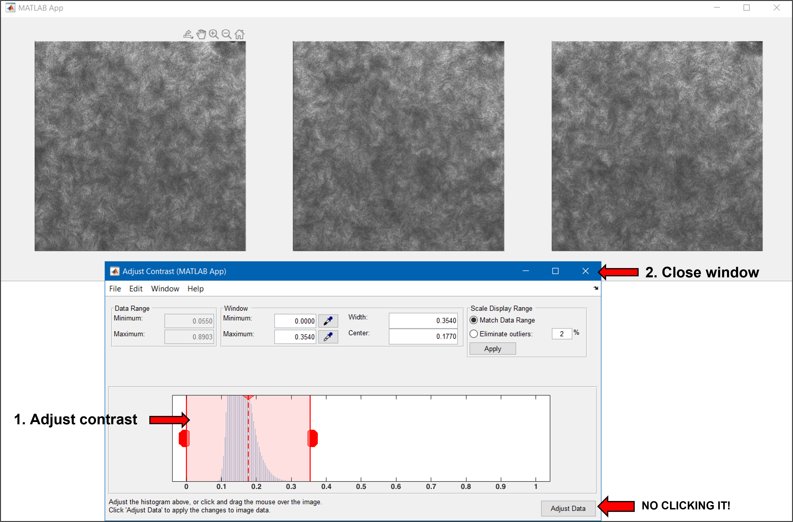
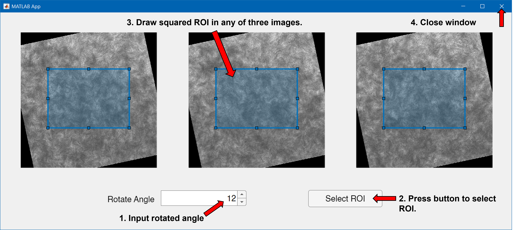
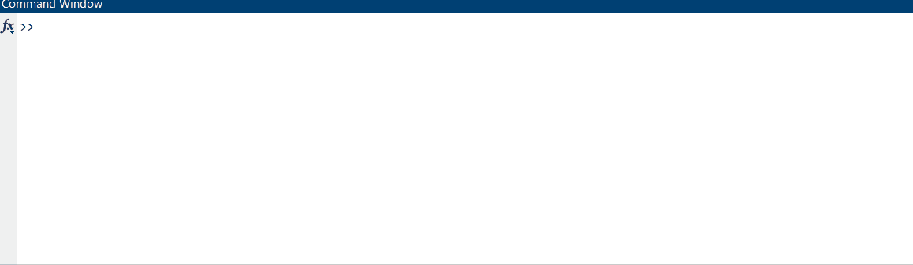
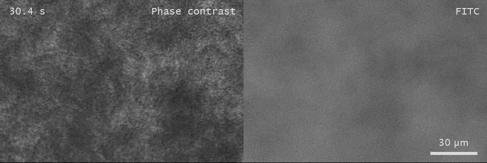

            __      ___     _              _           _           _ _
            \ \    / (_) __| | ___  ___   | |     ____| |__   ___ | | | ___  _____
             \ \  / /| |/ _  |/ _ \/ _ \  | |    / _  |  _ \ / _ \| | |/ _ \|  __/
              \ \/ / | | (_| |  __/ ( ) | | |___| (_| | |_) |  __/| | |  __/| |
               \__/  |_|\____|\___|\___/  |__ __|\____|_ __/ \____|_|_|\____|_|

# VideoLabeller: Easy to convert and label `.nd2` file


To convert `.nd2` file into labelled `.mp4` video in MATLAB.

<!-- GETTING STARTED -->
## Getting Started

### Prerequisites

- __Matlab__

- __Computer Vision Toolbox__ ('Home' --> 'Add-Ons') to fast label video.

- __Image Processing Toolbox__ ('Home' --> 'Add-Ons') to load GUI.

- __[Nd2SdkMatlab](https://github.com/tytghy/Nd2SdkMatlab/)__ to read `.nd2` file.

### Installation Options

1. Install with [`git`](https://git-scm.com/)

    ```sh
    git clone https://github.com/tytghy/VideoLabeller.git
    ```

2. Download ZIP from [VideoLabeller](https://github.com/tytghy/VideoLabeller) and unzip the files.  

## Usage

1. Adjust the parameters in `parameters.m` based on the rawdata.
2. Run it.

> Also see **[Example](#example)**.

## Example

> To see the fast-moving motion in fluorescence and phase contrast microscopy simultaneously, we acquired a fast timelapse image sequence with fluorescent (f) and phase contrast (pc) images in alternate frames.  Here, we used the program below to output the video.  
>  
> The key is to set `nFreqDiv = 2` because the image sequence follows order pc-f-pc-f.
>
> Follow the steps below to have a try.

### 1. Adjust parameters in `parameters.m`

```matlab
%% File:
filename = 'G:\20x_phase_contrast_fluorescent_images.nd2';
savedir = 'G:\';

%% Image acquisition:
objective = 20; % as objective is indicated in filename, the program will ignore this line.
nFreqDiv = 2; % Importance
startTime = 0; % Starting time will be 0 s.

%% Exported images:
% Empty for all.
exportPara.exportedT = []; % output all time series.
exportPara.exportEveryNumFrame = 2; % output every 2 frames.

% At most two dimensions can be selected. For example, if channelNo and
% XYNo contains multiple elements, ZNo must be a scalar.
exportPara.exportedFreqNo = []; 
exportPara.exportedChannelNo = []; 
exportPara.exportedXYNo = [];
exportPara.exportedZNo = [];
exportPara.shortestSideLength = 720;

processPara.contrastMethod = 2; % manually adjust contrast; 
processPara.drawROI = 1; % draw ROI.
processPara.needScalebar = 1; % label scalebar; 
processPara.needScaleText =1; % label text of scalebar; 
processPara.needTimeStamp = 1; % label timestamp; 
processPara.title = {'Phase contrast', 'FITC'}; % label title of each channel.

%% Video:
isCompressed = 1; % output compressed 'MPEG-4'
frameRate = 20; % 20 fps

%% Execute
labelimage;
```

### 2. Run `parameters.m`

Simply click `Run` or select all followed by press `F9`.

### 3. Manually adjust contrast (Optional)

If `processPara.contrastMethod = 2` is selected, you need to manually adjust contrast of images.  A built-in GUI pops out (see below).



> You are asked to adjust contrast of several groups of images depending on how many channels are exported.  Here, it is two.  Close the window after adjusting the contrast.  Do not click `Adjust Data`.

### 4. Draw ROI (Optional)

If `processPara.drawROI = 1` is selected, you can freely select the squared ROI.  A custom-programed GUI pops out (see below).



> You are asked to select ROI of only one group of images.  The other channel will follow the same ROI in this group.  
>
> 1. Input rotated angle.
> 2. Draw ROI.  The ROI you draw in any of three images will map onto the other two.  
> 3. Close window.

### 5. Have a cup of tea :coffee:



### 6. Done.  Check in the `savedir`

Below is the snapshot of the output video.



## Parameters

There are parameters about file, image acquisition, exported setting, image post-processing and output video in `parameters.m`.  Listed below are the details of parameters.

### File

| Parameters | Description |
| ----------- | ----------- |
| `filename` | File to be converted |
| `savedir` | Directory to save the output video |

### Image acquisition

| Parameters | Description |
| ----------- | ----------- |
| `objective` | Objective used.  If the objective is specified in the filename, the program will ignore this parameter.  |
| `nFreqDiv` | Number of frequency division. E.g., `1`|
| `startTime` | Starting time (unit: s).  E.g., `0`|

> __Note__
>
> - The program recognizes the keyword `_?x_`, `?x_` and `_?x.nd2` as objective used. E.g., objective will be recognized as 20 for the filename of '20x_cell.nd2', 'cell_20x.nd2', 'cell_20x_liquid.nd2'.
>
> - A 6.5 µm pixel camera sensor is used by default.  This means that with a 10x objective, the pixel size at the image is in fact 6.5/10 = 0.65 µm.

### Exported images

All the parameters related to the exported channels include in the struct `exportPara`.

| Parameters | Description |
| ----------- | ----------- |
| `exportedT` | Export images of time (or frame) ranging from `exportedT(1)` to `exportedT(2)`.  Leave it empty `[]` if all are wanted. <br /> E.g., `[1 200]`|
| `exportEveryNumFrame` | Export images every `exportEveryNumFrame` frames. <br /> E.g., `2`|
| `exportedFreqNo` | If `nFreqDiv` is not 1, export images in Channel No. `exportedFreqNo`. Leave it empty `[]` if all are wanted. <br /> E.g., `[1]`|
| `exportedChannelNo` | Export images of $\lambda$ Channel No. `exportedChannelNo`. Leave it empty `[]` if all are wanted. <br /> E.g., `[1 2 3]`|
| `exportedXYNo` | Export images of $XY$ Channel No. `exportedXYNo`. Leave it empty `[]` if all are wanted. <br /> E.g., `[1 2 3]`|
| `exportedZNo` | Export images in $Z$ Channel No. `exportedZNo`. Leave it empty `[]` if all are wanted. <br /> E.g., `[]` |
| `shortestSideLength` | The shortest side length of each pannel for the output video.  <br /> E.g., `720`|

### Image post-processing

All the parameters related to the image post-processing include in the struct `processPara`.

| Parameters | Description |
| ----------- | ----------- |
| `contrastMethod` | Method to adjust contrast of video. <br /> `0`: Do nothing; `1`: Auto; `2`: Manual.|
| `drawROI` | Draw ROI? <br /> `0`: No; `1`: Yes. |
| `needScalebar` | Label scale bar?  <br /> `0`: No; `1`: Yes |
| `needScaleText` | Label the actual size of scale bar?  <br />  `0`: No; `1`: Yes |
| `needTimeStamp` | Label the time stamp? <br />  `0`: No; `1`: Yes |
| `title` | Title of each channel.  It is a cell array of character vectors.  <br /> E.g., `{'FITC', 'mCherry'}`|

> __Note__
>
> A GUI will pop out, allowing you to adjust contrast or draw ROI, if `contrastMethod = 2` or `drawROI = 1`.  See [Example](#example).

### Output video

| Parameters | Description |
| ----------- | ----------- |
| `isCompressed` | Compress the output video? <br /> `0`: No, output an uncompressed `.avi` file with grayscale video; <br /> `1`: Yes, output a `.mp4` file with H.264 encoding.|
| `frameRate` | Frame rate of output video. <br /> E.g., `20` |

<!-- ### Snapshot

You can attach the snapshot in the report and briefly see what's going on without watching a video.

| Parameters | Description |
| ----------- | ----------- |
| `needSnapshot` | Need snapshots? `0`: No; `1`: Yes |
| `nSnap` | How many snapshots do you need? E.g., `4`. | -->

## Acknowledgements

Some interesting resource lists:

- [ASCII Art Archive](https://www.asciiart.eu/)
- [GitHub Emoji Cheat Sheet](https://www.webpagefx.com/tools/emoji-cheat-sheet)

## License

This project is licensed under the terms of the [MIT](/LICENSE).
